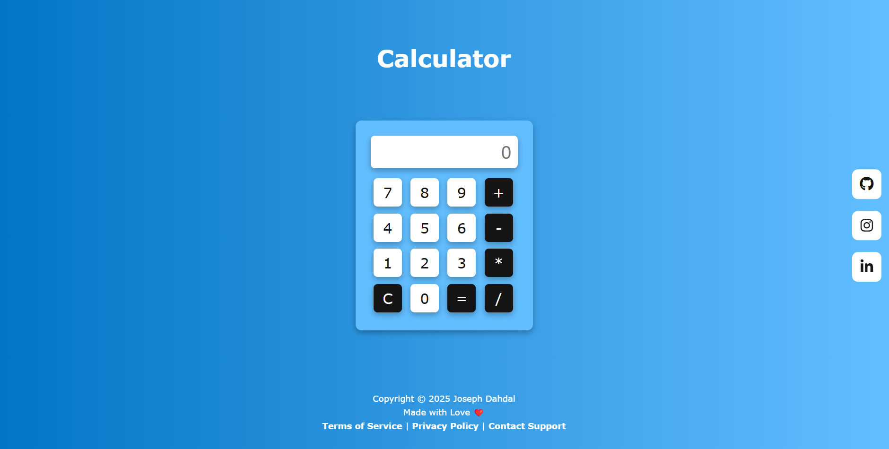

# 🧮 Basic Calculator

A simple and efficient **Basic Calculator** that performs fundamental arithmetic operations. Built with **HTML, CSS, and JavaScript**, this minimalistic yet functional calculator provides a smooth user experience.

## 🚀 Features

- 🎨 **Clean & Responsive UI** – Designed for simplicity and ease of use.
    
- 🔢 **Basic Operations** – Supports addition, subtraction, multiplication, and division.
    
- ⚡ **Fast & Lightweight** – No external libraries, just pure HTML, CSS, and JavaScript.
    

## 🛠️ Technologies Used

- **HTML** – Structure
    
- **CSS** – Styling & Layout
    
- **JavaScript** – Functionality
    

## 📷 Preview

## 📖 How to Use

1. Click on the **numbers** to input values.
    
2. Select an **operator** (+, -, ×, ÷).
    
3. Click **"="** to see the result.
    
4. Use **"C"** to clear the input field.
    

## 🌎 Try It Out!

You can visit the **Basic Calculator** website online and try it yourself:

🔗 **[Website](https://forjoee.github.io/Basic-Calculator/)**
